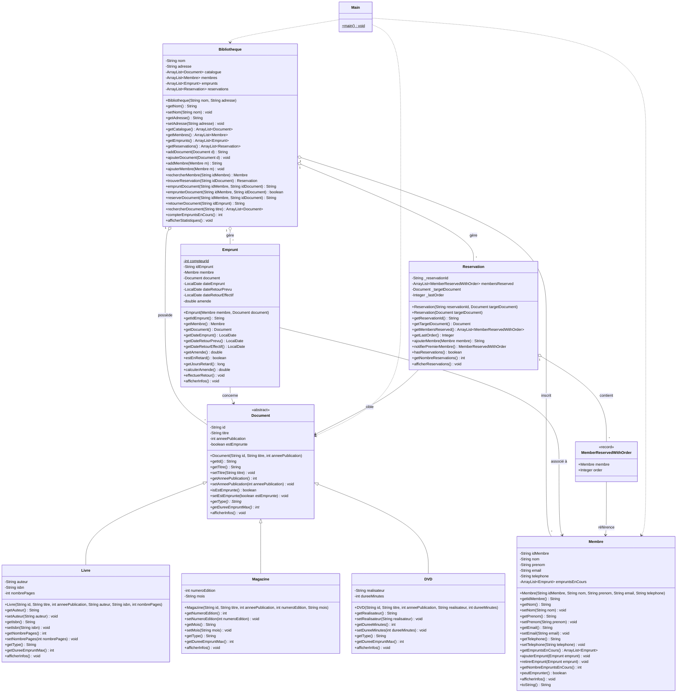
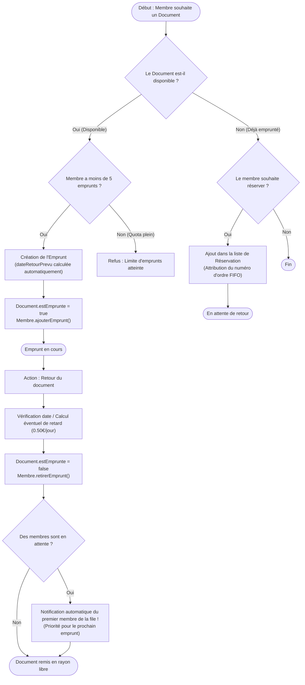
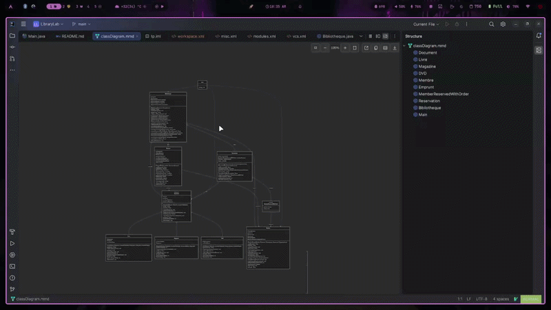

# Système de Gestion de Bibliothèque (LibraryLab)

Système complet de gestion de bibliothèque développé en **Java 21**, basé sur le document de travaux pratiques et cours **`TP_Cours_Java_POO.pdf`** (*Programmation Orientée Objet*).

Ce projet illustre la mise en pratique des quatre piliers fondamentaux de la POO (**Encapsulation**, **Héritage**, **Polymorphisme**, **Abstraction**) ainsi que des fonctionnalités modernes de Java (Records, gestion de dates avec `java.time`, fonctionnalités d'aperçu Java 21).

---

## Sommaire

1. [Concepts Clés de POO](#concepts-clés-de-poo)
2. [Diagrammes du Projet](#diagrammes-du-projet)
   - [Diagramme de Classes (UML / Mermaid)](#diagramme-de-classes-uml--mermaid)
   - [Diagramme des Flux & Cycle de Vie (Emprunt, Réservation & Retour)](#diagramme-des-flux--cycle-de-vie-emprunt-réservation--retour)
3. [Architecture et Classes](#architecture-et-classes)
4. [Structure du Projet](#structure-du-projet)
5. [Prérequis](#prérequis)
6. [Instructions d'Exécution par Environnement](#instructions-dexécution-par-environnement)
   - [1. Linux & macOS (Terminal / Bash)](#1-linux--macos-terminal--bash)
   - [2. Windows (PowerShell & CMD)](#2-windows-powershell--cmd)
   - [3. IntelliJ IDEA](#3-intellij-idea)
   - [4. Visual Studio Code](#4-visual-studio-code)
   - [5. Docker (Eclipse Temurin 21)](#5-docker-eclipse-temurin-21)
7. [Exemple de Sortie Console](#exemple-de-sortie-console)

---

## Concepts Clés de POO

- **Abstraction** : La classe abstraite [`Document`](file:///home/essid/Projects/java-labs/Java-Labs/LibraryLab/src/Document.java) définit le contrat commun (`getType()`, `getDureeEmpruntMax()`) sans être instanciable directement.
- **Encapsulation** : Tous les attributs sont déclarés `private` avec un accès contrôlé via des getters/setters et des règles métier (limite de 5 emprunts, vérification de disponibilité).
- **Héritage** : Les sous-classes spécialisées [`Livre`](file:///home/essid/Projects/java-labs/Java-Labs/LibraryLab/src/Livre.java), [`Magazine`](file:///home/essid/Projects/java-labs/Java-Labs/LibraryLab/src/Magazine.java) et [`DVD`](file:///home/essid/Projects/java-labs/Java-Labs/LibraryLab/src/DVD.java) héritent des propriétés et comportements de [`Document`](file:///home/essid/Projects/java-labs/Java-Labs/LibraryLab/src/Document.java) via `extends` et réutilisent son constructeur via `super()`.
- **Polymorphisme** : Redéfinition (`@Override`) de [`afficherInfos()`](file:///home/essid/Projects/java-labs/Java-Labs/LibraryLab/src/Livre.java#L43) pour chaque type de document et manipulation uniforme des documents au sein du catalogue (`ArrayList<Document>`).
- **Java Moderne (Records & Java 21)** : Utilisation d'un `record` immuable [`MemberReservedWithOrder`](file:///home/essid/Projects/java-labs/Java-Labs/LibraryLab/src/MemberReservedWithOrder.java) pour représenter les réservations ordonnées et point d'entrée simplifié avec aperçu Java 21.

---

## Diagrammes du Projet

### Diagramme de Classes (UML / Mermaid)



---

### Diagramme des Flux & Cycle de Vie (Emprunt, Réservation & Retour)



---

## Architecture et Classes

### 1. [`Document`](file:///home/essid/Projects/java-labs/Java-Labs/LibraryLab/src/Document.java) (Classe Abstraite)
Classe mère de tous les documents. Contient les attributs génériques (`id`, `titre`, `anneePublication`, `estEmprunte`) et impose deux méthodes abstraites :
- `getType()` : retourne le libellé du type.
- `getDureeEmpruntMax()` : retourne le quota de jours alloué.

### 2. Classes Dérivées : [`Livre`](file:///home/essid/Projects/java-labs/Java-Labs/LibraryLab/src/Livre.java), [`Magazine`](file:///home/essid/Projects/java-labs/Java-Labs/LibraryLab/src/Magazine.java), [`DVD`](file:///home/essid/Projects/java-labs/Java-Labs/LibraryLab/src/DVD.java)
- **`Livre`** : 21 jours d'emprunt max. Attributs : `auteur`, `isbn`, `nombrePages`.
- **`Magazine`** : 7 jours d'emprunt max. Attributs : `numeroEdition`, `mois`.
- **`DVD`** : 14 jours d'emprunt max. Attributs : `realisateur`, `dureeMinutes`.

### 3. [`Membre`](file:///home/essid/Projects/java-labs/Java-Labs/LibraryLab/src/Membre.java)
Gère l'identité du membre (`idMembre`, `nom`, `prenom`, `email`, `telephone`) et sa collection active `empruntsEnCours`. La méthode `peutEmprunter()` garantit qu'aucun membre ne dépasse la limite autorisée de **5 documents**.

### 4. [`Emprunt`](file:///home/essid/Projects/java-labs/Java-Labs/LibraryLab/src/Emprunt.java)
Associe un `Membre` et un `Document`. Calcule automatiquement la date de retour prévue grâce à `java.time.LocalDate`. En cas de dépassement lors du retour, `calculerAmende()` applique la pénalité de **0.50 € par jour de retard**.

### 5. [`Reservation`](file:///home/essid/Projects/java-labs/Java-Labs/LibraryLab/src/Reservation.java) & [`MemberReservedWithOrder`](file:///home/essid/Projects/java-labs/Java-Labs/LibraryLab/src/MemberReservedWithOrder.java)
Système de réservation (Partie 4 : Exercice 1) permettant aux membres de se positionner sur un document déjà emprunté.
- Un compteur d'ordre séquentiel (`_lastOrder`) garantit une gestion équitable de type **FIFO** (First-In, First-Out).
- Dès qu'un document emprunté est retourné, `notifierPremierMembre()` déclenche la notification du premier adhérent sur la file d'attente.

### 6. [`Bibliotheque`](file:///home/essid/Projects/java-labs/Java-Labs/LibraryLab/src/Bibliotheque.java)
Contrôleur central du système. Il encapsule le catalogue de documents, les membres inscrits, l'historique des emprunts et les réservations actives, tout en fournissant les opérations d'emprunt, retour, recherche et statistiques.

---

## Structure du Projet

```text
LibraryLab/
├── .idea/                             # Configuration IntelliJ IDEA (JDK 21 Preview)
├── src/
│   ├── Bibliotheque.java              # Contrôleur central de la bibliothèque
│   ├── Document.java                  # Classe abstraite de base
│   ├── DVD.java                       # Spécialisation Document (DVD)
│   ├── Emprunt.java                   # Gestion des prêts, dates et amendes
│   ├── Livre.java                     # Spécialisation Document (Livre)
│   ├── Magazine.java                  # Spécialisation Document (Magazine)
│   ├── Main.java                      # Point d'entrée de test et démonstration
│   ├── MemberReservedWithOrder.java   # Record immuable (Membre + ordre d'attente)
│   ├── Membre.java                    # Gestion des adhérents
│   └── Reservation.java               # Système de file d'attente pour réservations
├── out/                               # Fichiers binaires compilés (.class)
├── README.md                          # Documentation complète et diagrammes
├── TP_Cours_Java_POO .pdf             # Énoncé du TP & Cours POO
└── tp.iml                             # Descripteur de module IntelliJ
```

---

## Prérequis

- **Java Development Kit (JDK)** : Version **21** ou supérieure (avec support des fonctionnalités de préversion `--enable-preview`).
- Vérifiez votre version installée :
  ```bash
  java -version
  javac -version
  ```

---

## Instructions d'Exécution par Environnement

### 1. Linux & macOS (Terminal / Bash)

Depuis le dossier `LibraryLab` :

#### Compilation et Exécution standard
```bash
# 1. Compiler toutes les classes avec les flags Java 21 preview
javac --enable-preview --release 21 -d out src/*.java

# 2. Exécuter le programme principal
java --enable-preview -cp out Main
```

#### En une seule ligne
```bash
javac --enable-preview --release 21 -d out src/*.java && java --enable-preview -cp out Main
```

---

### 2. Windows (PowerShell & CMD)

Ouvrez un terminal (`PowerShell` ou `cmd.exe`) dans le répertoire `LibraryLab` :

#### Via PowerShell
```powershell
# Compilation
javac --enable-preview --release 21 -d out (Get-Item src/*.java)

# Exécution
java --enable-preview -cp out Main
```

En une seule ligne sous PowerShell :
```powershell
javac --enable-preview --release 21 -d out (Get-Item src/*.java); if ($?) { java --enable-preview -cp out Main }
```

#### Via Invite de commandes (cmd.exe)
```cmd
javac --enable-preview --release 21 -d out src\*.java
java --enable-preview -cp out Main
```

---

### 3. IntelliJ IDEA

1. Ouvrez **IntelliJ IDEA**.
2. Allez dans **File > Open...** et sélectionnez le dossier `LibraryLab`.
3. Assurez-vous que le projet est bien configuré en mode **Java 21 Preview** :
   - Rendez-vous dans **File > Project Structure > Project**.
   - Vérifiez que **SDK** est sur `JDK 21` et que **Language Level** est sur `21 (Preview) - String templates, unnamed classes, etc.`.
4. Ouvrez le fichier `src/Main.java`.
5. Cliquez sur l'icône verte **Run** à côté de la méthode `main`, ou utilisez le raccourci `Shift + F10`.

---

### 4. Visual Studio Code

1. Installez l'**Extension Pack for Java** de Microsoft.
2. Ouvrez le dossier `LibraryLab` dans VS Code :
   ```bash
   code .
   ```
3. Dans les configurations du runtime Java (`.vscode/settings.json`), ajoutez les arguments de préversion :
   ```json
   {
     "java.configuration.runtimes": [
       {
         "name": "JavaSE-21",
         "path": "/chemin/vers/jdk-21",
         "default": true
       }
     ]
   }
   ```
4. Ouvrez `src/Main.java` et cliquez sur le bouton **Run**.

---

### 5. Docker (Eclipse Temurin 21)

Pour tester ou exécuter le projet sans installer Java en local :

```bash
docker run --rm -v "$PWD":/app -w /app eclipse-temurin:21 sh -c "javac --enable-preview --release 21 -d out src/*.java && java --enable-preview -cp out Main"
```

---

## Exemple de Sortie Console

```text
=== LISTE DES MEMBRES ===
Membre[id=Member-01, nom=Amine essid, email=essid@gmail.com, emprunts=0]
Membre[id=Member-02, nom=Salma Mansour, email=salma@gmail.com, emprunts=0]
Membre[id=Member-03, nom=Goback Ben Khaled, email=goback@gmail.com, emprunts=0]
Membre[id=Member-04, nom=Sadek Ben Sadek, email=sadek@gmail.com, emprunts=0]

=== TEST DU POLYMORPHISME (afficherInfos) ===
=== Informations du Document ===
ID: L001
Titre: 1984
Année: 1949
Type: Livre
Statut: Disponible
Auteur: George Orwell
ISBN: 978-0451524935
Nombre de pages: 328
Durée d'emprunt max: 21 jour

=== Informations du Document ===
ID: M001
Titre: Science & Vie
Année: 2024
Type: Magazine
Statut: Disponible
Numéro d'édition: 1289
Mois: Janvier
Durée d'emprunt max: 7 jours

=== Informations du Document ===
ID: D001
Titre: Inception
Année: 2010
Type: DVD
Statut: Disponible
Réalisateur: Christopher Nolan
Durée: 148 minutes
Durée d'emprunt max: 14 jours

=== OPERATIONS D'EMPRUNT ===
Emprunt L001 par Member-01 : emprunt réussi
Emprunt D001 par Member-01 : emprunt réussi
Emprunt L001 par Member-02 (déjà emprunté) : document déjà emprunté

=== SYSTEME DE RESERVATION (Partie 4 : Ex 1) ===
Réservation L001 par Member-02 : réservation ajoutée avec succès (ordre 1)
Réservation L001 par Member-03 : réservation ajoutée avec succès (ordre 2)
=== Liste d'attente pour : 1984 ===
 - Ordre 1 : Salma Mansour (ID: Member-02)
 - Ordre 2 : Goback Ben Khaled (ID: Member-03)

=== RETOUR ET NOTIFICATION AUTOMATIQUE ===
Notification : Le document '1984' est maintenant disponible pour Salma Mansour (Ordre d'attente : 1)
Retour de EMP0001 : Document retourné avec succès

=== STATISTIQUES ===
Nom : Bibliothèque Centrale
Adresse : Avenue Habib Bourguiba, Tunis
Nombre de documents : 4
Nombre de membres : 4
Nombre d'emprunts au total : 2
Nombre d'emprunts en cours : 1
 - Livres : 2
 - Magazines : 1
 - DVDs : 1
Nombre de réservations enregistrées : 1
```

## Short Gif


