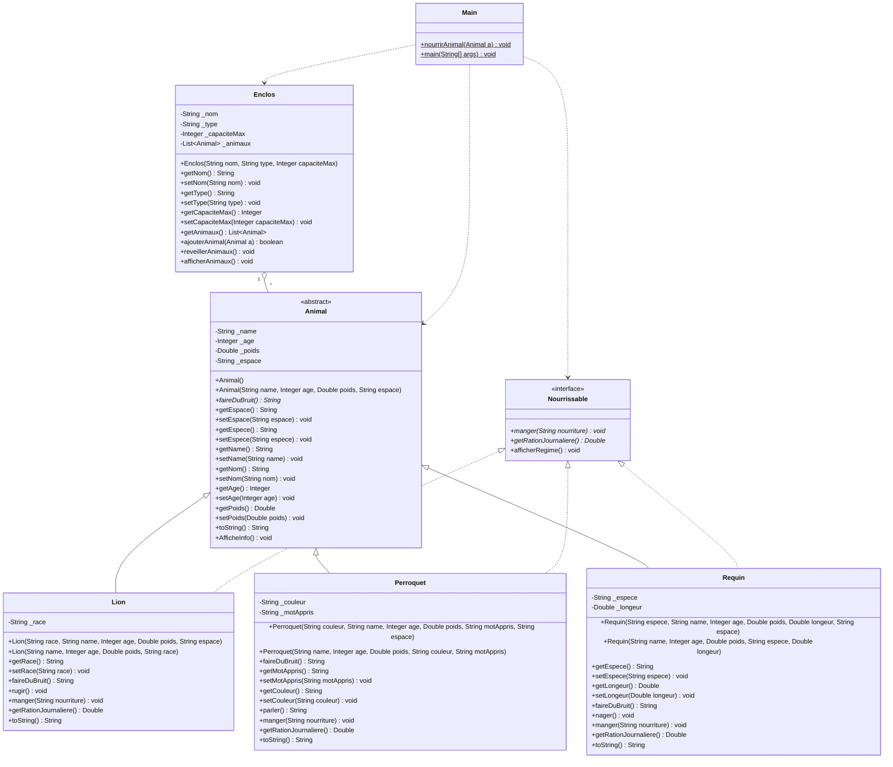
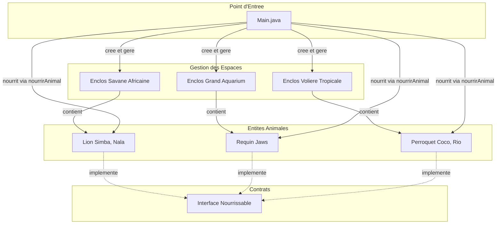

# TP Zoo (Animal, Lion ...)
## Amine Essid - Ing - 2 - 12

Système de gestion d'un Zoo développé en Java illustrant les concepts fondamentaux de la **Programmation Orientée Objet (POO)** : encapsulation, héritage, polymorphisme, classes abstraites, interfaces et composition.

---

## Sommaire

1. [Aperçu de l'Architecture](#aperçu-de-larchitecture)
2. [Diagrammes](#diagrammes)
   - [Diagramme de Classes UML](#diagramme-de-classes-uml)
   - [Diagramme des Relations et Flux](#diagramme-des-relations-et-flux)
3. [Structure du Projet](#structure-du-projet)
4. [Prérequis](#prérequis)
5. [Instructions d'Exécution par Environnement](#instructions-dexécution-par-environnement)
   - [1. Linux & macOS (Terminal / Bash / Zsh)](#1-linux--macos-terminal--bash--zsh)
   - [2. Windows (PowerShell & Invite de commandes CMD)](#2-windows-powershell--invite-de-commandes-cmd)
   - [3. IntelliJ IDEA](#3-intellij-idea)
   - [4. Visual Studio Code (VS Code)](#4-visual-studio-code-vs-code)
   - [5. Eclipse IDE](#5-eclipse-ide)
   - [6. Docker (Sans installation locale de Java)](#6-docker-sans-installation-locale-de-java)
6. [Exemple de Sortie Console](#exemple-de-sortie-console)

---

## Aperçu de l'Architecture

Le projet simule la gestion des pensionnaires d'un zoo et de leurs enclos :
- **`Animal`** : Classe abstraite modélisant les attributs communs (nom, âge, poids, espèce) et définissant la méthode abstraite `faireDuBruit()`.
- **`Nourrissable`** : Interface définissant le contrat de nourrissage (`manger()`, `getRationJournaliere()`, et méthode par défaut `afficherRegime()`).
- **`Lion`**, **`Perroquet`**, **`Requin`** : Sous-classes concrètes spécialisées héritant d'`Animal` et implémentant `Nourrissable`.
- **`Enclos`** : Classe composite gérant un groupe d'animaux jusqu'à une capacité maximale.
- **`Main`** : Point d'entrée de l'application orchestrant la création des entités, le réveil des enclos, le test du polymorphisme et le nourrissage.

---

## Diagrammes

### Diagramme de Classes UML



### Diagramme des Relations et Flux



---

## Structure du Projet

```text
ZooProject/
├── .idea/                  # Configuration IntelliJ IDEA
├── src/
│   ├── Main.java           # Point d'entrée principal
│   └── animals/
│       ├── Animal.java     # Classe abstraite de base
│       ├── Enclos.java     # Classe de gestion des enclos (composition)
│       ├── Lion.java       # Sous-classe Mammifère
│       ├── Nourrissable.java # Interface de nourrissage
│       ├── Perroquet.java  # Sous-classe Oiseau
│       └── Requin.java     # Sous-classe Poisson
├── README.md               # Documentation du projet
└── ZooProject.iml          # Descripteur de module IntelliJ
```

---

## Prérequis

- **Java Development Kit (JDK)** : Version **17** ou supérieure (**JDK 21** recommandée).
- Pour vérifier la présence de Java sur votre système :
  ```bash
  java -version
  javac -version
  ```

---

## Instructions d'Exécution par Environnement

### 1. Linux & macOS (Terminal / Bash / Zsh)

Depuis la racine du projet (`ZooProject`) :

#### Compilation et Exécution standard
```bash
# 1. Compiler les classes dans un dossier de sortie 'bin'
javac -d bin -sourcepath src src/Main.java

# 2. Exécuter la classe principale
java -cp bin Main
```

#### En une seule ligne
```bash
javac -d bin -sourcepath src src/Main.java && java -cp bin Main
```

#### Nettoyage
```bash
rm -rf bin
```

---

### 2. Windows (PowerShell & Invite de commandes CMD)

Ouvrez un terminal (`PowerShell` ou `cmd.exe`) à la racine du projet `ZooProject` :

#### Via PowerShell
```powershell
# Compilation
javac -d bin -sourcepath src src/Main.java

# Exécution
java -cp bin Main
```

En une seule ligne sous PowerShell :
```powershell
javac -d bin -sourcepath src src/Main.java; if ($?) { java -cp bin Main }
```

#### Via Invite de commandes (cmd.exe)
```cmd
javac -d bin -sourcepath src src\Main.java
java -cp bin Main
```

En une seule ligne sous CMD :
```cmd
javac -d bin -sourcepath src src\Main.java && java -cp bin Main
```

#### Nettoyage
```cmd
# Sous cmd :
rmdir /s /q bin

# Sous PowerShell :
Remove-Item -Recurse -Force bin
```

---

### 3. IntelliJ IDEA

1. Lancez **IntelliJ IDEA**.
2. Cliquez sur **File > Open...** et sélectionnez le dossier `ZooProject`.
3. Vérifiez la configuration du SDK :
   - Allez dans **File > Project Structure > Project**.
   - Assurez-vous que **SDK** est configuré sur Java 17 ou Java 21+.
   - Vérifiez que le dossier `src` est bien marqué comme **Sources Root** (clic droit sur `src` > **Mark Directory as > Sources Root** si nécessaire).
4. Ouvrez le fichier `src/Main.java`.
5. Cliquez sur l'icône verte **Run** (flèche verte) à côté de `public class Main` ou de `public static void main(...)`, ou utilisez le raccourci `Shift + F10` (Windows/Linux) ou `Ctrl + R` (macOS).

---

### 4. Visual Studio Code (VS Code)

1. Installez l'extension recommandée : **Extension Pack for Java** (de Microsoft).
2. Ouvrez le dossier du projet dans VS Code :
   ```bash
   code .
   ```
3. VS Code détectera automatiquement la structure Java.
4. Ouvrez le fichier `src/Main.java`.
5. Cliquez sur le lien **Run** qui apparaît au-dessus de la méthode `main`, ou appuyez sur `F5` pour lancer l'exécution avec débogage.

---

### 5. Eclipse IDE

1. Lancez **Eclipse IDE**.
2. Allez dans **File > Import... > General > Projects from Folder or Directory**.
3. Sélectionnez le dossier racine `ZooProject` et cliquez sur **Finish**.
4. Configurez le Build Path si nécessaire :
   - Clic droit sur le projet > **Build Path > Configure Build Path...**
   - Assurez-vous que le dossier `src` est dans l'onglet **Source** et que la **JRE System Library** est configurée sur Java 17+.
5. Faites un clic droit sur `src/Main.java` > **Run As > Java Application**.

---

### 6. Docker (Sans installation locale de Java)

Si vous disposez de [Docker](https://www.docker.com/) mais ne souhaitez pas installer le JDK localement :

#### Linux / macOS
```bash
docker run --rm -v "$PWD":/app -w /app eclipse-temurin:21 sh -c "javac -d bin -sourcepath src src/Main.java && java -cp bin Main"
```

#### Windows (PowerShell)
```powershell
docker run --rm -v "${PWD}:/app" -w /app eclipse-temurin:21 sh -c "javac -d bin -sourcepath src src/Main.java && java -cp bin Main"
```

---

## Exemple de Sortie Console

Lors du lancement du programme, la console affiche :

```text
Simba ajoute a Savane Africaine
Nala ajoute a Savane Africaine
Jaws ajoute a Grand Aquarium
Coco ajoute a Volière Tropicale
Rio ajoute a Volière Tropicale

=== BIENVENUE AU ZOO ===

Enclos [Mammifères] Savane Africaine (2/4) :
 - [Felin] Name: Simba | Age: 5 | Poids: 190.0 kg, Lion => Race: Africain
 - [Felin] Name: Nala | Age: 4 | Poids: 135.0 kg, Lion => Race: Berbère
Enclos [Poissons] Grand Aquarium (1/3) :
 - [Poisson] Name: Jaws | Age: 10 | Poids: 680.0 kg | Grand Blanc | 5.500000m
Enclos [Oiseaux] Volière Tropicale (2/5) :
 - [Oiseau] Name: Coco | Age: 3 | Poids: 0.4 kg | Plumage: Vert
 - [Oiseau] Name: Rio | Age: 2 | Poids: 0.5 kg | Plumage: Rouge

=== Reveil de Savane Africaine ===
Simba RUGIT ! ROARRR
Nala RUGIT ! ROARRR

=== Reveil de Volière Tropicale ===
Coco crie: Bonjour !
Rio crie: Ola ! !

=== Reveil de Grand Aquarium ===
Jaws ...(silence)...

=== Test nourrirAnimal ===
Nourrissage de Simba
Simba RUGIT ! ROARRR
Nourrissage de Nala
Nala RUGIT ! ROARRR
Nourrissage de Coco
Coco crie: Bonjour !
Nourrissage de Rio
Rio crie: Ola ! !
Nourrissage de Jaws
Jaws ...(silence)...

=== Interface Nourrissable ===
Simba :
Ration journalière : 7.6000000000000005 kg
Simba devore : nourriture quotidienne
Nala :
Ration journalière : 5.4 kg
Nala devore : nourriture quotidienne
Coco :
Ration journalière : 0.04000000000000001 kg
Coco picore : nourriture quotidienne
Rio :
Ration journalière : 0.05 kg
Rio picore : nourriture quotidienne
Jaws :
Ration journalière : 13.6 kg
Jaws engloutit : nourriture quotidienne
```
